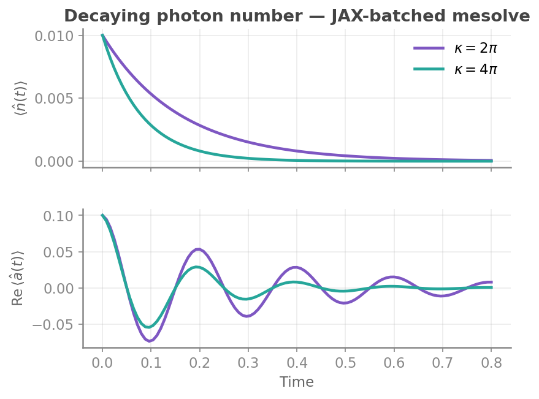

<h1 align="center">
    
</h1>


[](https://opensource.org/license/apache-2-0) [](https://github.com/EQuS/jaxquantum/releases) [](https://pypi.org/project/jaxquantum/)

[S. R. Jha](https://github.com/Phionx), [S. Chowdhury](https://github.com/shoumikdc), [G. Rolleri](https://github.com/GabrieleRolleri), [M. Hays](https://scholar.google.com/citations?user=06z0MjwAAAAJ), [J. A. Grover](https://scholar.google.com/citations?user=igewch8AAAAJ), [W. D. Oliver](https://scholar.google.com/citations?user=4vNbnqcAAAAJ&hl=en)

**Docs:** [equs.github.io/jaxquantum](https://equs.github.io/jaxquantum)

**Community Discord:** [discord.gg/frWqbjvZ4s](https://discord.gg/frWqbjvZ4s)

`jaxquantum` leverages [JAX](https://github.com/google/jax) to enable the auto differentiable and (CPU, GPU, TPU) accelerated simulation of quantum dynamical systems, including tooling such as operator construction, unitary evolution and master equation solving. As such, `jaxquantum` serves as a QuTiP drop-in replacement written entirely in JAX.

Moreover, `jaxquantum` has recently absorbed [`bosonic`](https://github.com/EQuS/bosonic) and [`qcsys`](https://github.com/EQuS/qcsys). As such, it is now a unified toolkit for quantum circuit design, simulation and control. 


## Installation


### Installing from source (recommended)

**Recommended:** As this is a rapidly evolving project, we recommend installing the latest version of `jaxquantum` from source as follows:
```
pip install git+https://github.com/EQuS/jaxquantum.git
```

### Installing from source in editable mode (recommended for developers)

If you are interested in contributing to the package, please clone this repository and install this package in editable mode after changing into the root directory of this repository:
```
pip install -e ".[dev,docs]"
```
This will also install extras from the `dev` and `docs` flags, which can be useful when developing the package. Since this is installed in editable mode, the package will automatically be updated after pulling new changes in the repository. 

### Installing from PyPI (not recommended)

`jaxquantum` is also published on PyPI. Simply run the following code to install the package:

```bash
pip install jaxquantum
```

For more details, please visit the getting started > installation section of our [docs](https://equs.github.io/jaxquantum/getting_started/installation.html).

## An Example

Here's an example of how to set up a simulation in jaxquantum.

```python
from jax import jit
import jaxquantum as jqt 
import jax.numpy as jnp
import matplotlib.pyplot as plt

N = 100

omega_a = 2.0*jnp.pi*5.0
kappa = 2*jnp.pi*jnp.array([1,2]) # Batching to explore two different kappa values!
initial_state = jqt.displace(N, 0.1) @ jqt.basis(N,0)
initial_state_dm = initial_state.to_dm()
ts = jnp.linspace(0, 4*2*jnp.pi/omega_a, 101)

a = jqt.destroy(N)
n = a.dag() @ a

c_ops = jqt.Qarray.from_list([jnp.sqrt(kappa)*a])

@jit
def Ht(t):
    H0 = omega_a*n
    return H0

solver_options = jqt.SolverOptions.create(progress_meter=True)
states = jqt.mesolve(Ht, initial_state_dm, ts, c_ops=c_ops, solver_options=solver_options) 
nt = jnp.real(jqt.calc_expect(n, states))
a_real = jnp.real(jqt.calc_expect(a, states))
a_imag = jnp.imag(jqt.calc_expect(a, states))

fig, axs = plt.subplots(2,1, dpi=200, figsize=(6,5))
ax = axs[0]
ax.plot(ts, a_real[:,0], label=r"$Re[\langle a(t)\rangle]$", color="blue") # Batch kappa value 0
ax.plot(ts, a_real[:,1], "--", label=r"$Re[\langle a(t)\rangle]$", color="blue") # Batch kappa value 1
ax.plot(ts, a_imag[:,0], label=r"$Re[\langle a(t)\rangle]$", color="red") # Batch kappa value 0
ax.plot(ts, a_imag[:,1], "--", label=r"$Re[\langle a(t)\rangle]$", color="red") # Batch kappa value 1
ax.set_xlabel("Time (ns)")
ax.set_ylabel("Expectations")
ax.legend()

ax = axs[1]
ax.plot(ts, nt[:,0], label=r"$Re[\langle n(t)\rangle]$", color="green") # Batch kappa value 0
ax.plot(ts, nt[:,1], "--", label=r"$Re[\langle n(t)\rangle]$", color="green") # Batch kappa value 1
ax.set_xlabel("Time (ns)")
ax.set_ylabel("Expectations")
ax.legend()
fig.tight_layout()
```



## Acknowledgements & History

**Core Devs:** [Shantanu R. Jha](https://github.com/Phionx), [Shoumik Chowdhury](https://github.com/shoumikdc), [Gabriele Rolleri](https://github.com/GabrieleRolleri)


This package was initially a small part of [`bosonic`](https://github.com/EQuS/bosonic). In early 2022, `jaxquantum` was extracted and made into its own package. This package was briefly announced to the world at APS March Meeting 2023 and released to a select few academic groups shortly after. Since then, this package has been open sourced and developed while conducting research in the Engineering Quantum Systems Group at MIT with invaluable advice from [Prof. William D. Oliver](https://equs.mit.edu/william-d-oliver/). 

## Citation

Thank you for taking the time to try our package out. If you found it useful in your research, please cite us as follows:

```bibtex
@software{jha2024jaxquantum,
  author = {Shantanu R. Jha and Shoumik Chowdhury and Gabriele Rolleri and Max Hays and Jeff A. Grover and William D. Oliver},
  title  = {An auto differentiable and hardware accelerated software toolkit for quantum circuit design, simulation and control},
  url    = {https://github.com/EQuS/jaxquantum, https://github.com/EQuS/bosonic, https://github.com/EQuS/qcsys},
  version = {0.1.0},
  year   = {2024},
}
```
> S. R. Jha, S. Chowdhury, G. Rolleri, M. Hays, J. A. Grover, W. D. Oliver. An auto differentiable and hardware accelerated software toolkit for quantum circuit design, simulation and control (2025), in preparation.


## Contributions & Contact

This package is open source and, as such, very open to contributions. Please don't hesitate to open an issue, report a bug, request a feature, or create a pull request. We are also open to deeper collaborations to create a tool that is more useful for everyone. If a discussion would be helpful, please email [shanjha@mit.edu](mailto:shanjha@mit.edu) to set up a meeting. 
