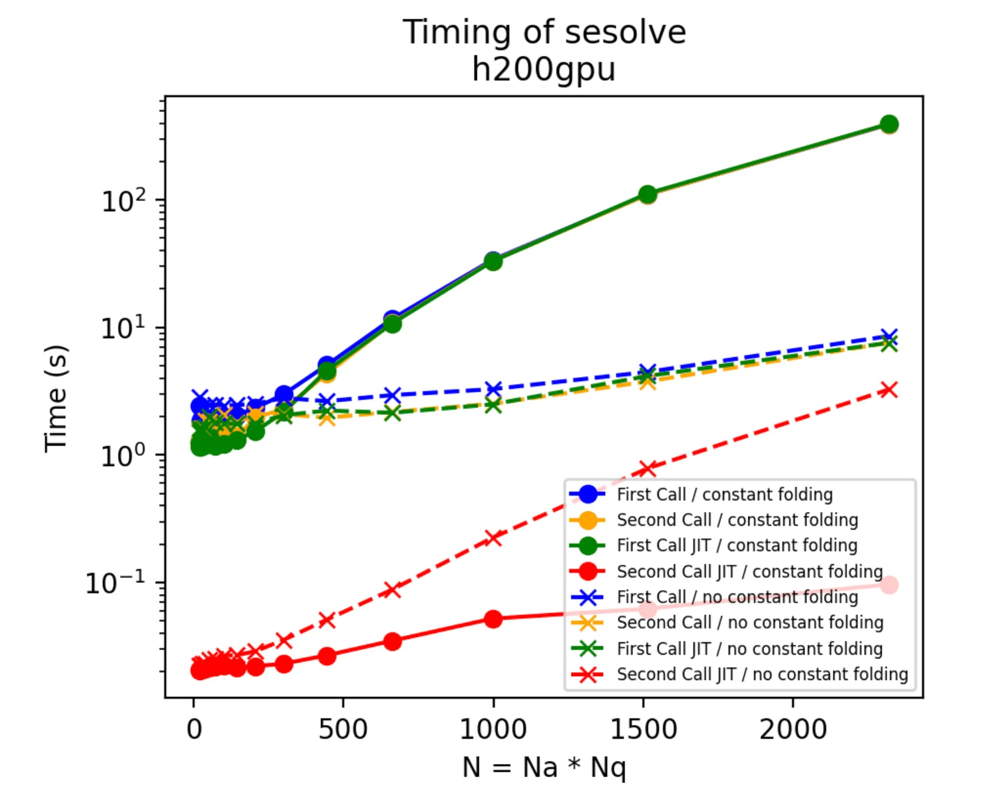

This is a non-exhaustive, but growing list of common pitfalls when using `jaxquantum`.

# JAX

!!! quote 
    When walking about the countryside of Italy, the people will not hesitate to tell you that JAX has [*“una anima di pura programmazione funzionale”*](https://www.sscardapane.it/iaml-backup/jax-intro/). ~ JAX docs

Often the sharp bits poking at you originate from the functional paradigm within which JAX operates. The JAX developers have compiled a great list of these common "gotchas": https://docs.jax.dev/en/latest/notebooks/Common_Gotchas_in_JAX.html 


# Constant folding

JAX constant folding is an optimization where constant expressions are evaluated at compile time rather than runtime, reducing computation during execution. For example, if a function contains only operations on constants, JAX may precompute the result and replace the expression with the constant value.

While this can reduce the runtime of a jitted function on the second and subsequent runs, constant folding can greatly increase the compile time and, in turn, how long the first run of a jitted function takes. 

In computations where either only one run of a function is required or the first run (with constant folding enabled) is taking way too long, the user can try disabling constant folding. 

To do so, run this at the top of your Jupyter notebook or at the top of your python script:
```python
import os
os.environ['XLA_FLAGS'] = "--xla_disable_hlo_passes=constant_folding"
```
Note that this code must be run before JAX is imported. 


As an example, here's the timing results of running a simple `sesolve` simulation with and without jitting and with and without constant folding.

As shown above, constant folding rapidly increase the runtime of the first call to a function, while disabling constant folding significantly speeds up the first call of a function.

However, the fastest runtime for a function call is the second call of a jitted function with constant folding. Notably, the second call of a function always runs on different inputs than the first call, in this benchmark.

So, it may be worth paying the cost of the first call of a jitted function with constant folding, if the user wishes to use the jitted function many times. 


# Operations

## Tensor product shorthand `^`

Note that the shorthand for tensor product `^` is evaluated after other basic math operations (e.g. `+,-,*,/,@`). So, when using this shorthand, it is best practice to use parentheses. 


!!! example "Tensor shorthand."
    For example, the following code will fail:
    ```python
    jqt.identity(2)^jqt.identity(3) + jqt.identity(2)^jqt.identity(3)
    ```

    !!! failure "Output"
        ```text
        ValueError: Dimensions are incompatible: ((3,), (3,)) and ((2,), (2,))
        ```
    This is because `jqt.identity(3) + jqt.identity(2)` is running before the tensor products.


    Instead, we should use parentheses to specify the order of operations to begin with `^`.

    ```python
    (jqt.identity(2)^jqt.identity(3)) + (jqt.identity(2)^jqt.identity(3))
    ```

    !!! success "Output"
        ```text
        Quantum array: dims = ((2, 3), (2, 3)), bdims = (), shape = (6, 6), type = oper
        Qarray data =
        [[2.+0.j 0.+0.j 0.+0.j 0.+0.j 0.+0.j 0.+0.j]
        [0.+0.j 2.+0.j 0.+0.j 0.+0.j 0.+0.j 0.+0.j]
        [0.+0.j 0.+0.j 2.+0.j 0.+0.j 0.+0.j 0.+0.j]
        [0.+0.j 0.+0.j 0.+0.j 2.+0.j 0.+0.j 0.+0.j]
        [0.+0.j 0.+0.j 0.+0.j 0.+0.j 2.+0.j 0.+0.j]
        [0.+0.j 0.+0.j 0.+0.j 0.+0.j 0.+0.j 2.+0.j]]
        ```

