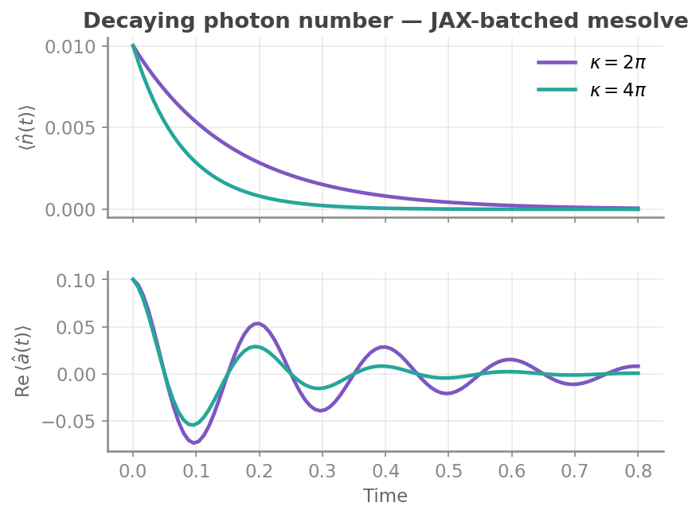
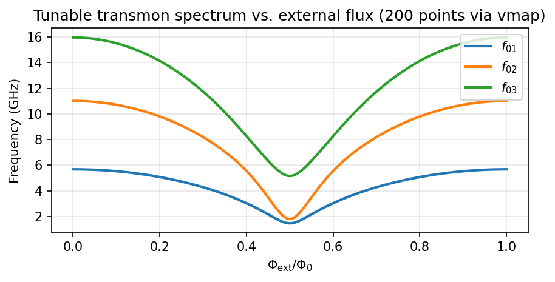

---
hide:
  - navigation
  - toc
---

<div class="hero" markdown>

<div class="hero-text" markdown>

# jaxquantum

<p class="hero-tagline">A JAX-native toolkit for quantum hardware design, simulation, and control.</p>

<p class="hero-subline">Auto-differentiable. Accelerated on CPU, GPU, and TPU.</p>

<div class="hero-install" markdown>
```bash
pip install jaxquantum # Py 3.11+
```
</div>

<div class="hero-buttons" markdown>
[Get Started :material-arrow-right:](documentation/getting_started/installation.md){ .md-button .md-button--primary }
[Tutorials](documentation/tutorials/index.md){ .md-button }
[GitHub](https://github.com/EQuS/jaxquantum){ .md-button }
</div>

</div>

<div class="hero-code" markdown>

```python
import jaxquantum as jqt
import jax, jax.numpy as jnp

def expect_n(alpha):
    psi = jqt.displace(50, alpha) @ jqt.basis(50, 0)
    return jnp.real(jqt.tr(jqt.num(50) @ psi.to_dm()))

# auto-differentiate, vectorize, and jit-compile
dexpect_n = jax.jit(jax.vmap(jax.grad(expect_n))) 

%timeit -n1 -r1 dexpect_n(jnp.linspace(0, 3, 100))  # compile
%timeit -n1 -r1 dexpect_n(jnp.linspace(0, 5, 100))  # much faster!
```
```text title="Output"
813 ms ± 0 ns per loop (mean ± std. dev. of 1 run, 1 loop each)
454 μs ± 0 ns per loop (mean ± std. dev. of 1 run, 1 loop each)
```

</div>

</div>

---

## Why jaxquantum?

<div class="grid cards" markdown>

-   :material-flash: **JAX-native**

    ---

    Use `jax.vmap` (batch), `jax.jit` (compile), and `jax.grad` (autodiff) directly on quantum simulations. Built on batchable `Qarray` objects that wrap JAX `Array`s.

-   :material-circle-double: **QuTiP drop-in**

    ---

    Familiar API for operator construction, unitary evolution, and master equation solving — but everything is a JAX `Qarray`.

-   :material-chip: **Superconducting devices**

    ---

    Ready-to-use Transmon, Fluxonium, and Resonator models. Diagonalize, sweep flux, and fit physical parameters with autodiff.

    [:octicons-arrow-right-24: Devices tutorial](documentation/tutorials/devices.ipynb)

-   :material-atom-variant: **Bosonic codes**

    ---

    Cat, GKP, and Binomial qubit encodings with logical gates and phase-space visualization.

    [:octicons-arrow-right-24: Bosonic codes tutorial](documentation/tutorials/bosonic_codes.ipynb)

-   :material-source-branch: **Gate-based circuits**

    ---

    Hierarchical circuits with unitary, Hamiltonian, and Kraus simulation modes. Optimize gate parameters end-to-end with `grad`.

    [:octicons-arrow-right-24: Circuits tutorial](documentation/tutorials/circuits.ipynb)

-   :material-database: **Sparse backends**

    ---

    `SparseDIA` and `BCOO` storage for large Hilbert spaces. Same API as dense; dramatic memory savings and faster `sesolve` at large $N$.

    [:octicons-arrow-right-24: Sparse backends tutorial](documentation/tutorials/sparse_backends.ipynb)

</div>

---

## See it in action

### Master equation, batched over decay rates

Solve the Lindblad equation for a driven oscillator at two photon-loss rates **in a single call** — `jaxquantum` automatically batches over the array-valued `kappa`.

<div class="demo" markdown>

<div class="demo-code" markdown>
```python
from jax import jit
import jaxquantum as jqt
import jax.numpy as jnp

N = 100
omega = 2*jnp.pi*5.0
kappa = 2*jnp.pi*jnp.array([1.0, 2.0])  # batch over two decay rates

rho0 = (jqt.displace(N, 0.1) @ jqt.basis(N, 0)).to_dm()
ts   = jnp.linspace(0, 4*2*jnp.pi/omega, 101)
c_ops = jqt.Qarray.from_list([jnp.sqrt(kappa) * jqt.destroy(N)])

@jit
def H(t):
    return omega * jqt.num(N)

states = jqt.mesolve(H, rho0, ts, c_ops=c_ops)
n_t    = jnp.real(jqt.overlap(jqt.num(N), states))   # (101, 2)
a_t    = jqt.overlap(jqt.destroy(N), states)         # (101, 2)
```
</div>

<div class="demo-plot" markdown>

</div>

</div>

### Tunable transmon spectrum via `vmap`

Sweep 200 flux values through a SQUID transmon in one compiled call.

<div class="demo demo--reverse" markdown>

<div class="demo-code" markdown>
```python
import jaxquantum.devices as jqtd
import jax, jax.numpy as jnp

@jax.jit
def get_freqs(phi_ext):
    t = jqtd.TunableTransmon.create(
        N=4,
        params={"Ec": 0.3, "Ej1": 8.0, "Ej2": 7.0, "phi_ext": phi_ext},
        N_pre_diag=41, basis=jqtd.BasisTypes.charge,
    )
    Es = t.eig_systems["vals"]
    return Es - Es[0]

# 200 flux points, one compiled call
all_freqs = jax.vmap(get_freqs)(jnp.linspace(0, 1, 200))
```
</div>

<div class="demo-plot" markdown>

</div>

</div>

---

## Explore the tutorials

<div class="grid cards" markdown>

-   :material-chip: __[Devices & Systems](documentation/tutorials/devices.ipynb)__

    ---

    Build a Transmon, sweep flux with `vmap`, and fit Ec/Ej to spectroscopy data with `grad`.

-   :material-atom-variant: __[Bosonic Codes](documentation/tutorials/bosonic_codes.ipynb)__

    ---

    Construct cat, GKP, and binomial codes. Visualize codewords and run logical gate dynamics.

-   :material-source-branch: __[Circuits](documentation/tutorials/circuits.ipynb)__

    ---

    Compose gate-based circuits with mixed unitary/Hamiltonian/Kraus evolution. Optimize with autodiff.

-   :material-database: __[Sparse Backends](documentation/tutorials/sparse_backends.ipynb)__

    ---

    Efficiently scale to massive Hilbert spaces with Sparse Diagonal, BCOO, and other backends.

</div>

---

## Citation

If `jaxquantum` is useful in your research, please cite:

```bibtex
@software{jha2024jaxquantum,
  author  = {Shantanu R. Jha and Shoumik Chowdhury and Gabriele Rolleri and Max Hays and Jeff A. Grover and William D. Oliver},
  title   = {JAXQuantum: An auto-differentiable and hardware-accelerated toolkit for quantum hardware design, simulation, and control},
  url     = {https://jaxquantum.org},
  version = {0.3.0},
  year    = {2024},
}
```

## Community

- [Discord](https://discord.gg/frWqbjvZ4s) — chat with users and developers
- [GitHub Issues](https://github.com/EQuS/jaxquantum/issues) — bug reports and feature requests
- [shanjha@mit.edu](mailto:shanjha@mit.edu) — for deeper collaborations

Developed in the [Engineering Quantum Systems Group](https://equs.mit.edu) at MIT.
